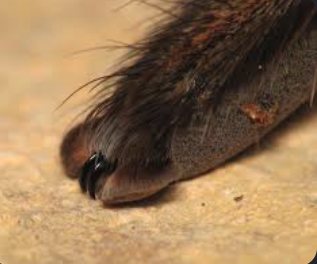

**Help for anyone new to stardance challenge**
>stuff I have done (maybe help someone in the future)--

>completed the steps here-- https://auth.hackclub.com/

>explored this site -- https://stardance.hackclub.com/ and registered the project cosmo-arachnid

>completed the steps here to track project time -- https://hackatime.hackclub.com/  (make sure to give access to github)

>created this directory and found out that I need to initialise git here with "git init" and publish the repo on github for hackatime to track the project.

>if you do get stuck like a commit that keep hovering, make sure you didn't just commmit without adding a message, if you did then simply check a file that should have opened in you editor like EDIT_DMS , something like that and on the top linegit branch -M main just add your message and save.
```
How winning prizes works — 
It's a points-based system:

Build a project — anything technical and open-source: a website, game, app, hardware, simulation (like me).
Publish it — ship it publicly so others can see it.
Earn stardust — other teens rate your project, and the higher your rating, the more stardust (points) you earn. Hours spent also factor in (roughly 10 stardust per hour based on the example on the site).
Spend stardust in the shop — redeem it for real prizes like Raspberry Pis, 3D printers, a Framework Laptop, Meta Quest 3, AMD GPU, iPad, and more.

```
more useful links

https://www.nasa.gov/stem-content/hack-club-stardance-challenge/

https://lapse.hackclub.com/ (I'll record anything non code here to add it to my total hours. for e.g 3d model of the spider or simulation time)

---

>### My Intro:
> I am **sundeep (18 M)** from India. I have been fascinated by machines and robots forever. I have been inspired by people like **Mark Rober** who worked on the **curiosity rover** . I got into robotics for the first time when I made a really simple LED based ironman repulsor in like 7th grade in the middle of the night after crying about it. Then I got my hands into an unused ESP 8266 from my sister's project , then i made a robotic hand in 10th standard, discovered ROS2 in 12th standard and here I am still learning about simulations in my summer vactions after I joined an university (iiitnr). 

>The project I have chosen might be out of hand for me now, but not for long, as I have been working on my ROS skills here-- https://github.com/sundeep-kp/ros2-roadmap-ultralab 

> You can contact me on my [linkedin](https://www.linkedin.com/in/sundeepskp/)

# PLAN

### Project Intro:

The project is a ROS2 based simulation of an eight legged, eight eyed, spider robot (design inpired by a jumping spider ) that can explore rocky planets like mars.


the robot flies using propulsors (not sure which). I need to figure out eight legged locomotion first. so i doubt gazebo a little bit . what i wanna achieve first is manual A S W D controls to move around in a way that it smoothly traverses rocky terrain so like automatically adjusts how far the legs go into the ground and maybe even side to side a little bit (don't wanna perch leg on an unstable rock). I genuinely don't know what tech stack to pick apart from ROS, no idea of simulators. I would even need to like simulate rocky planetary sandy martian ground somehow (mars looks like a good place to start)


I chose an eight legged one bcz it can traverse the landscape more efficiently than other pedal robot or even  a robotic car for that matter. 


Then eight eyes both to capture the entire surrounding without distortion and saving time to move its head (it takes a few minutes for instructions to travel from earth to mars).


That's what i wanna achieve in this, this much is complicated enough and i don't wanna insert more complications until i do this much

## current techstack in mind

### Gazebo harmoics + ROS2

after a quick lookup I found that with this we can add --

Deformable/uneven terrain via heightmaps (you can import real Mars elevation data from NASA)

Contact physics for leg-ground interaction

Custom robot  URDF/SDF models

>For Mars-like ground specifically, Gazebo supports heightmap terrain from grayscale images. NASA actually publishes Mars elevation data (HiRISE DEMs) you could use directly.

>For legs control-- inverse kinematics (IK) — instead of manually controlling each joint, you tell the foot where to be in 3D space and IK figures out the joint angles. We'll have to place some sensors in the paws of each legs



